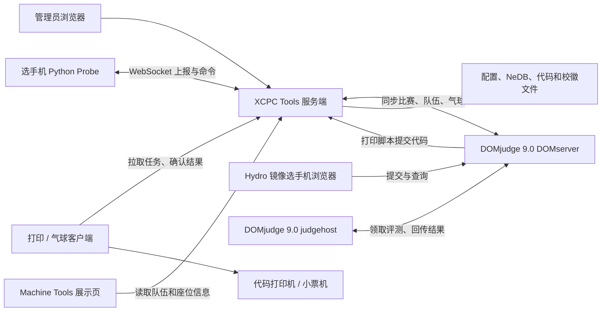

# XCPC Tools Linux 安装与部署指南

本文仅介绍 Linux 部署：**XCPC Tools 服务端使用 Ubuntu Server 26.04 LTS，打印工作站使用 Ubuntu 26.04 LTS，选手机使用 [Hydro Contest OS](https://contest.hydro.ac/zh/contest-os/) 镜像，OJ 与评测系统使用 [DOMjudge 9.0](https://www.domjudge.org/docs/manual/9.0/overview.html)**。选手机步骤以镜像页面提供的 **2025 赛季镜像（Ubuntu 24.04.3 LTS、amd64、GNOME Flashback）**为准。项目介绍与原有使用说明见 [README.md](README.md)。

XCPC Tools 是面向 ICPC、CCPC 等程序设计竞赛现场的运维工具：把代码打印、气球小票与通知、选手机状态监控、远程命令、座位图和赛前队伍展示集中到一个管理界面。它可独立运行，也可连接 Hydro 或 DOMjudge 获取比赛数据。

本项目不包含 OJ 判题服务、打印机驱动或视频采集服务；这些组件需要分别准备。服务端使用 Node.js / TypeScript，管理界面使用 React / Mantine，数据保存在本地 NeDB 和文件中，无需另外安装数据库。选手机端由 Python Probe 和可选的 Neutralino 桌面程序 Machine Tools 组成。

> 本文对应当前仓库实现。正式部署时，服务端、打印客户端、Probe 和 Machine Tools 应使用同一版本的代码或配套发布文件，并记录 Release tag / commit。当前代码打印协议为 **v4**，旧版打印客户端不能连接新版服务端；历史 Release 不一定包含本文全部功能。

## 目录

- [1. 部署结构与准备工作](#deployment)
- [2. 安装服务端](#server)
- [3. 安装打印与气球客户端](#client)
- [4. 接入 DOMjudge 9.0 评测系统](#oj)
- [5. 部署选手机 Probe 与 Machine Tools](#machines)
- [6. 配置座位图与赛前展示](#presentation)
- [7. 可选集成：视频、WebSSH、Prometheus、Bot、HTTPS](#integrations)
- [8. 赛前验收与日常操作](#acceptance)
- [9. 备份、恢复与升级](#maintenance)
- [10. 源码构建与开发验证](#development)
- [11. 常见问题](#troubleshooting)

<a id="deployment"></a>

## 1. 部署结构与准备工作

### 1.1 各组件安装在哪里

| 组件 | 安装位置 | 作用 | 是否必需 |
| --- | --- | --- | --- |
| XCPC Tools 服务端 | 一台固定地址的管理服务器 | 管理界面、任务队列、OJ 同步、设备记录 | 必需 |
| 打印 / 气球客户端 | 能访问打印机的工作站 | 拉取任务，调用本机打印系统或小票机 | 使用实体打印时需要 |
| Python Probe | 每台选手机 | 周期上报、接收命令、回传结果 | 使用监控或远程命令时需要 |
| Machine Tools | Linux 选手机的桌面环境 | 本机配置、检查、赛前展示 | 可选 |
| DOMjudge 9.0 DOMserver | OJ 服务器 | 选手提交、裁判管理、API、比赛数据与打印入口 | 本场方案需要 |
| DOMjudge 9.0 judgehost | 独立评测机 | 从 DOMserver 领取提交，编译并评测 | 本场方案至少一台 |
| 视频服务 / exporter / SSH 服务 | 选手机 | 分别提供视频、监控指标、交互终端 | 按需安装 |



服务端与打印客户端使用**同一个核心程序**；添加 `--client` 切换为客户端。Machine Tools 是另一份发布包，不是打印客户端。

### 1.2 本文示例约定

- 服务端内网 IP：`10.10.0.10`，地址：`http://10.10.0.10:5283/`。
- 服务端目录：`/srv/xcpc-tools/server`；打印客户端目录：`/srv/xcpc-tools/client`。
- 服务端和打印客户端的服务账号：`xcpc`；各机器使用 APT 和 systemd。
- XCPC Tools 服务端 / 打印工作站为 Ubuntu 26.04；选手机为 Hydro Contest OS 2025（Ubuntu 24.04.3），保留镜像的竞赛环境和桌面配置。
- OJ 使用 DOMjudge 9.0 系列，DOMserver 示例地址为 `https://domjudge.example.org/`；DOMserver 和 judgehost 使用同一已验收的 9.0.x 发布版本。
- 座位号：`A01`、`A02`、`B01`。OJ 中的 location、展示名单和选手机座位号采用同一套命名。
- 所有 `REPLACE_WITH_...` 都是占位符，使用前替换；不要把示例密钥直接用于比赛。
- 除非特别说明，命令在其所在章节指定的机器执行；服务端与客户端不必位于同一台机器。

**工作目录决定数据位置。** 程序从当前工作目录读取 `config.server.yaml` 或 `config.client.yaml`，并在其中创建 `data/`。从其他目录启动同一程序，会读到另一套配置和数据。每个服务端数据目录、每个打印客户端工作目录只运行一个对应进程。

### 1.3 网络与系统准备

| 发起方 → 接收方 | 端口 / 地址 | 用途 |
| --- | --- | --- |
| 管理浏览器、打印客户端、选手机 → 服务端 | TCP 5283，HTTP / WebSocket | 管理、打印任务、`/report`、`/probe`、展示 |
| 服务端 → OJ | OJ 实际 HTTP / HTTPS 端口 | 数据同步及完成回报 |
| 选手机浏览器、judgehost → DOMserver | OJ 实际 HTTP / HTTPS 端口 | 选手提交、评测任务及结果 |
| DOMserver → XCPC Tools 服务端 | TCP 5283，或配置好的 HTTPS 地址 | `print_command` 提交打印任务 |
| 打印客户端 → 打印机 | USB 或打印系统配置的网络端口 | 实体打印 |
| 服务端 → 选手机 | TCP 22，可选 | WebSSH |
| 服务端 → 选手机 | 视频服务端口，例如 TCP 9090，可选 | 视频代理 |
| Prometheus → 选手机 | exporter 端口，例如 TCP 9100，可选 | 指标采集 |
| 打印客户端本机浏览器 | `127.0.0.1:5284` | 本机只读状态页 |

服务端默认监听 `0.0.0.0:5283`，本身不提供 TLS。比赛内网应限制访问来源：管理员能管理，选手机和打印客户端能访问所需接口，服务端能访问 OJ 和选手机。管理流量需要 HTTPS 时见 [7.5](#https)。

选手机上报应经可路由的内网**直接连接服务端**。当前程序按连接来源记录机器 IP，没有提供可信 `X-Forwarded-For` 配置；普通反向代理或 NAT 会让多台机器显示为代理 / NAT 地址，影响视频、WebSSH、IP 导出和 Prometheus。

提前完成以下准备：

1. 固定服务端地址，检查跨网段路由、防火墙、DNS 与时间同步。
2. 使用持久磁盘保存服务端和客户端数据；安排备份空间。
3. 在打印工作站安装驱动，用实际运行客户端的系统账号完成一次操作系统测试打印。
4. 如需源码构建或 JS bundle，按 [2.5](#node24) 安装 Node.js 24；源码构建使用项目固定的 Yarn 4.12.0。
5. 选手机先安装 Hydro Contest OS，再用其 Ubuntu 24.04 系统 Python 安装 Probe；按第 5 节补齐依赖并接入管理服务。

### 1.4 核对各机器的基础环境

选手机镜像的安装方式见 [5.1](#contest-image)。操作系统安装完成后，在各机器上确认版本与架构并安装基础工具：

```bash
cat /etc/os-release
dpkg --print-architecture
sudo apt update
sudo apt install ca-certificates curl tar xz-utils file openssl
```

| 机器 | `VERSION_ID` | APT 发行代号 | 架构 |
| --- | --- | --- | --- |
| XCPC Tools 服务端 / 打印工作站 | `26.04` | `resolute` | `amd64` 或 `arm64`，与所选程序一致 |
| Hydro Contest OS 2025 选手机 | `24.04` | `noble` | 官网镜像为 `amd64` |

基础系统信息见 [Ubuntu 26.04 发布说明](https://documentation.ubuntu.com/release-notes/26.04/)与 [Hydro 镜像说明](https://contest.hydro.ac/zh/contest-os/)。选手机的 24.04.3 属于 24.04 LTS，`VERSION_ID` 仍显示 `24.04`。按本场已验收的镜像部署，不把选手机升级到 26.04，也不混用 `noble` 和 `resolute` 软件源。

`python3-websockets` 等依赖位于 Universe。若 APT 提示找不到包，检查软件源的 Components 是否包含 `universe`；缺少时执行：

```bash
sudo apt install software-properties-common
sudo add-apt-repository --yes universe
sudo apt update
```

各组件使用不同的运行环境：

| 组件 | 系统环境 | 本指南采用的方式 |
| --- | --- | --- |
| 服务端 / 打印客户端 | Ubuntu 26.04 的 Node.js 仓库包为 22.x | 优先用核心可执行文件；JS bundle 和源码构建另装 Node.js 24 |
| 选手机 Probe | Hydro 镜像自带系统 Python 3.12 | 固定使用 `/usr/bin/python3`，从 `noble` 安装 `python3-websockets` |
| 选手机 GUI / 视频 | Hydro 镜像提供 GNOME Flashback、WebKitGTK 和 VLC | 沿用镜像桌面，实机确认 X11 会话及采集权限，见 7.1 |

版本依据：[Ubuntu 26.04 Node.js 包](https://packages.ubuntu.com/resolute/nodejs)、[Hydro 2025 镜像软件包清单](https://contest.hydro.org.cn/2025/filesystem.manifest.amd64.txt)、[Ubuntu 24.04 websockets 包](https://packages.ubuntu.com/noble/python3-websockets)。

仓库当前 CI 使用 Node.js 24 和 Python 3.11，没有固定的 Ubuntu 26.04 或 Hydro 镜像测试任务。本文已对照系统依赖、镜像文档与仓库实现，正式部署仍需在这两类系统的样机上按第 8 节验收。

硬件需求取决于机器数量、打印并发和同时观看的视频数量；本仓库没有给出经过压测的统一容量指标。按正式规模演练，重点观察 CPU、磁盘空间和视频带宽。

<a id="server"></a>

## 2. 安装服务端

### 2.1 选择安装包

在 [GitHub Releases](https://github.com/hydro-dev/xcpc-tools/releases/) 中选定一个版本。Ubuntu 部署使用以下发布文件：

| 文件 | 使用方式 |
| --- | --- |
| `xcpc-tools-linux.tar.gz` | Linux 核心程序 |
| `xcpc-tools-bundle.js` | 使用本机 Node.js 运行 |
| `xcpc-tools-machine-tools-linux.tar.gz` | Linux 选手机 GUI、Probe 与 systemd unit |

先检查压缩包实际目录和 CPU 架构。核心包由当前工作流保留 `dist/pkg/` 路径；Machine Tools 包内容直接位于归档根目录。没有对应架构的核心可执行文件时，使用 JS bundle 或 [源码构建](#development)，不要将操作系统名称等同于架构兼容保证。

### 2.2 Ubuntu 核心程序安装

以下命令用于**首次安装**，假设所选版本的 Linux 包已下载到当前目录：

```bash
tar -tzf xcpc-tools-linux.tar.gz
xcpc_extract_dir="$(mktemp -d)"
tar -xzf xcpc-tools-linux.tar.gz -C "$xcpc_extract_dir"
file "$xcpc_extract_dir/dist/pkg/xcpc-tools-linux"

# 账号已存在时跳过 useradd
sudo useradd --system --user-group --home-dir /srv/xcpc-tools --shell /usr/sbin/nologin xcpc
sudo install -d -o xcpc -g xcpc -m 0750 /srv/xcpc-tools/server
sudo install -m 0755 "$xcpc_extract_dir/dist/pkg/xcpc-tools-linux" /srv/xcpc-tools/server/xcpc-tools

# 首次运行生成配置，然后退出；这是正常的初始化过程
sudo -u xcpc sh -c 'cd /srv/xcpc-tools/server && ./xcpc-tools'
```

首次运行会生成 `config.server.yaml`，其中已有随机管理员密码、打印入口密钥、两个客户端 Token 和机器上报 Token。看到 `Config file generated` 后编辑配置，不要反复启动等待页面出现。

```bash
sudoedit /srv/xcpc-tools/server/config.server.yaml
sudo chown xcpc:xcpc /srv/xcpc-tools/server/config.server.yaml
sudo chmod 0600 /srv/xcpc-tools/server/config.server.yaml
```

### 2.3 配置独立运行模式

下面是一份可作为起点的完整服务端配置。建议保留首次生成的随机值，再按现场修改；手工新建时可多次运行 `openssl rand -hex 32` 分别生成不同密钥。

```yaml
# config.server.yaml
type: server
port: 5283
viewPass: 'REPLACE_WITH_RANDOM_ADMIN_PASSWORD'
secretRoute: 'REPLACE_WITH_RANDOM_PRINT_ROUTE'
customKeyfile: ''
arenaLayouts: data/arena-layouts.json

clients:
  - name: Print Room 01
    token: 'REPLACE_WITH_RANDOM_PRINT_TOKEN'
    type: [printer]
  - name: Balloon Desk
    token: 'REPLACE_WITH_RANDOM_BALLOON_TOKEN'
    type: [balloon]

ssh:
  enabled: false
  username: root

monitor:
  timeSync: false
  reportToken: 'REPLACE_WITH_RANDOM_REPORT_TOKEN'
  exporters:
    - job: node
      port: 9100
  auto:
    name: ''
    group: ''
    camera: ''
    desktop: ''
```

只做监控时可以设 `clients: []`；只需要一台代码打印客户端时可删除 Balloon 项。把未部署的客户端留在列表里，会产生对应的离线提示。

| 配置 | 用途 | 应放在哪里 |
| --- | --- | --- |
| `viewPass` | 管理界面的 Basic Auth 密码，用户名固定为 `admin` | 服务端和管理员使用 |
| `secretRoute` | `/print/{secretRoute}` 的打印提交密钥 | 服务端及 OJ 打印脚本 |
| `clients[].token` | 打印 / 气球客户端的访问凭据 | 服务端及对应客户端 |
| `monitor.reportToken` | HTTP、WebSocket 机器上报凭据 | 服务端及选手机 |
| 顶层 `token` | 可选的 OJ Authorization 内容 | 仅服务端的 OJ 接入配置 |

这些凭据不能相互替代。打印 / 气球客户端 Token 必须唯一，由 16–128 位字母、数字、下划线或连字符组成；不要用机房名或编号作为 Token。管理员密码建议使用随机十六进制字符串，避免 Basic Auth 解析中的特殊字符问题。

`monitor.reportToken` 为空时，`/report` 和 `/probe` 均拒绝上报；不使用监控时这不影响打印，但 Checks 会提示上报认证未配置。密钥需要稳定保存，修改后同步更新所有使用方。

### 2.4 前台验证，再配置常驻

```bash
sudo -u xcpc sh -c 'cd /srv/xcpc-tools/server && ./xcpc-tools'
```

在管理电脑访问 `http://10.10.0.10:5283/`，用 `admin / viewPass` 登录。首次未配置座位图时，`Arena layouts file not found` 是提示，不妨碍基本功能。

也可以在另一终端检查认证后的入口；`curl` 会交互式询问密码：

```bash
curl --fail --user admin http://10.10.0.10:5283/ -o /dev/null
```

确认页面可用后按 Ctrl+C 结束前台进程，用 `sudoedit /etc/systemd/system/xcpc-tools-server.service` 创建 unit，内容如下：

```ini
[Unit]
Description=XCPC Tools Server
After=network-online.target
Wants=network-online.target

[Service]
Type=simple
User=xcpc
Group=xcpc
WorkingDirectory=/srv/xcpc-tools/server
ExecStart=/srv/xcpc-tools/server/xcpc-tools
Restart=on-failure
RestartSec=5
UMask=0077

[Install]
WantedBy=multi-user.target
```

```bash
sudo systemctl daemon-reload
sudo systemctl enable --now xcpc-tools-server.service
sudo systemctl status xcpc-tools-server.service --no-pager
sudo journalctl -u xcpc-tools-server.service -n 100 --no-pager
```

修改 YAML 后执行 `sudo systemctl restart xcpc-tools-server.service`；修改 unit 后先执行 `daemon-reload`。日志可能包含管理员登录信息，不要直接公开完整日志。使用专用服务账号时，配置、数据、布局和可选 SSH 私钥都必须对该账号具有所需权限。

<a id="node24"></a>

### 2.5 安装 Node.js 24 并运行 JS bundle（可选）

使用核心可执行文件时跳过本节。运行 JS bundle 或源码构建时，另装 Node.js 24；不要把 Ubuntu 26.04 的 `apt install nodejs` 当作安装 Node.js 24。

以下在 Ubuntu 上安装官方 Linux 二进制，示例固定为 `v24.21.0`。安装目录与系统软件包分开保存，版本文件及校验和来自 [Node.js 官方发布目录](https://nodejs.org/dist/v24.21.0/)。已经安装并验证 Node.js 24 的机器可使用原路径，无需重复安装。

```bash
(
    set -eu
    xcpc_node_version='v24.21.0'
    case "$(dpkg --print-architecture)" in
        amd64) xcpc_node_arch=x64 ;;
        arm64) xcpc_node_arch=arm64 ;;
        *) printf '本示例仅提供 amd64 / arm64 安装步骤\n' >&2; exit 1 ;;
    esac
    if [ -e /opt/node24 ] || [ -L /opt/node24 ]; then
        printf '/opt/node24 已存在，请先核对已有安装\n' >&2
        exit 1
    fi
    xcpc_node_dir="node-$xcpc_node_version-linux-$xcpc_node_arch"
    xcpc_node_archive="$xcpc_node_dir.tar.xz"
    xcpc_node_tmp="$(mktemp -d)"
    cd "$xcpc_node_tmp"
    curl -fSLO "https://nodejs.org/dist/$xcpc_node_version/$xcpc_node_archive"
    curl -fSLO "https://nodejs.org/dist/$xcpc_node_version/SHASUMS256.txt"
    awk -v archive="$xcpc_node_archive" '$2 == archive' SHASUMS256.txt > selected.sha256
    test -s selected.sha256
    sha256sum --check selected.sha256
    sudo install -d -m 0755 /opt
    sudo tar -xJf "$xcpc_node_archive" -C /opt --no-same-owner
    sudo ln -s "/opt/$xcpc_node_dir" /opt/node24
)
export PATH="/opt/node24/bin:$PATH"
node --version
```

每个新终端使用这套 Node 时，先执行上述 `export PATH`，或将其加入自己的 shell 配置。systemd 不读取个人 shell 配置，下面直接使用绝对路径。

把所选版本的 `xcpc-tools-bundle.js` 放入固定部署目录，目录和服务账号按 2.2 准备。在该目录初始化、填写 YAML 后，再运行相同命令：

```bash
sudo -u xcpc sh -c 'cd /srv/xcpc-tools/server && /opt/node24/bin/node ./xcpc-tools-bundle.js'
```

采用 bundle 部署时，把服务端 unit 中的 `ExecStart` 替换为：

```ini
ExecStart=/opt/node24/bin/node /srv/xcpc-tools/server/xcpc-tools-bundle.js
```

客户端同样在自己的工作目录运行 bundle，并添加 `--client`。后文备份、恢复等 `./xcpc-tools` 命令可改为 `/opt/node24/bin/node /绝对路径/xcpc-tools-bundle.js`，其余参数不变。

<a id="client"></a>

## 3. 安装打印与气球客户端

### 3.1 先让操作系统能够打印

代码打印在客户端使用内置 Typst / WebAssembly 和字体生成 PDF，再交给操作系统；不需要额外安装 Typst 命令行程序。

在 Ubuntu 打印工作站安装 CUPS：

```bash
sudo apt update
sudo apt install cups cups-client
sudo systemctl enable --now cups.service
```

在系统“打印机”设置或 CUPS 本机管理页中添加设备，并安装该打印机需要的驱动。之后查找队列，打印**自己准备的测试 PDF**：

```bash
lpstat -p -d
lp -d HP-East ./test.pdf
lpstat -o
```

`printers` 中填写 CUPS 队列名，不是打印机 IP 或显示在外壳上的型号。队列与选项用法见 [CUPS 命令行打印说明](https://www.cups.org/doc/options.html)。还需用实际运行客户端的账号验证队列权限。

### 3.2 创建客户端配置

把与服务端同版本的核心程序放到客户端固定目录，不要复用服务端数据目录。Linux 以下继续使用 `xcpc` 账号；若客户端在另一台机器，先参照 2.2 创建账号。也可全程替换为已验证打印能力的本机账号。

在所选 Linux 核心包的解压目录执行：

```bash
sudo install -d -o xcpc -g xcpc -m 0750 /srv/xcpc-tools/client
sudo install -m 0755 ./dist/pkg/xcpc-tools-linux /srv/xcpc-tools/client/xcpc-tools
sudoedit /srv/xcpc-tools/client/config.client.yaml
```

在客户端目录手工创建下面的 `config.client.yaml`。这种方式不依赖首次启动时的设备自动探测，也适用于没有 USB 小票机的机器。

```yaml
# config.client.yaml
server: 'http://10.10.0.10:5283/'
token: 'REPLACE_WITH_RANDOM_PRINT_TOKEN'

printers:
  - printer: HP-East
    group: A
  - printer: HP-West
    group: B
  - HP-Backup

printColor: false
printPageMax: 5
printMergeQueue: 1
fonts: []

balloon: ''
balloonLang: zh
balloonType: 80
balloonCommand: ''

localWeb:
  enabled: true
  host: 127.0.0.1
  port: 5284
```

将 Token 替换为服务端 Print Room 01 对应的值。打印机列表改为现场实际队列：只有一台打印机时可以只保留 `- HP-East`；`printers: []` 禁用代码打印。

Linux 示例还应设置文件所有者和权限：

```bash
sudo chown xcpc:xcpc /srv/xcpc-tools/client/config.client.yaml
sudo chmod 0600 /srv/xcpc-tools/client/config.client.yaml
sudo -u xcpc lpstat -p -d
```

路由规则：

1. 任务有明确 `group` 时，优先精确匹配打印机分组。
2. 任务未指定 `group` 时，按座位 `location` 的最长分组前缀匹配。
3. 没有可用的匹配分组打印机时，可以由全局打印机接收。
4. 字符串形式或未填写 `group` 的打印机属于全局打印机。分组会去除首尾空格并转为大写。

`printColor` 控制代码高亮颜色；`printPageMax` 是单次打印页数上限；`printMergeQueue` 为 1–20，先用 1 验收再考虑合并。页数超过上限的代码不会全部输出，应让选手和打印室知晓该限制。

### 3.3 启动和验收

```bash
sudo -u xcpc sh -c 'cd /srv/xcpc-tools/client && ./xcpc-tools --client'
```

采用 JS bundle 时，在客户端工作目录使用 `/opt/node24/bin/node ./xcpc-tools-bundle.js --client`，运行账号保持一致。

客户端会主动连接服务端，无需让服务端反向访问客户端。确认：

- 管理界面显示该客户端在线，并列出正确的打印机。
- 客户端本机可访问 `http://127.0.0.1:5284/`，查看连接、打印、气球和最近结果。
- 在服务端 `Checks` 页面使用 `Print test page`，按分组逐个确认**实际纸张**与任务状态。此操作会提交真实打印任务。

客户端状态页默认监听 loopback，且没有管理员认证，应保持 `host: 127.0.0.1`。多实例应使用不同工作目录、不同 Token 和不同本机端口；也可设 `localWeb.enabled: false`。端口被占用会阻止客户端启动。

需要 Linux 常驻时，先结束前台客户端，再参照服务端 unit 新建 `/etc/systemd/system/xcpc-tools-client.service`：把工作目录改为客户端目录，`ExecStart` 改为 `/srv/xcpc-tools/client/xcpc-tools --client`，运行账号和组改为已经完成打印测试的账号。该账号必须能写入客户端目录，并能访问 CUPS 队列或小票机设备。不要只在 root 终端验证后就认为普通服务账号也能打印。

```bash
sudo systemctl daemon-reload
sudo systemctl enable --now xcpc-tools-client.service
sudo journalctl -u xcpc-tools-client.service -n 100 --no-pager
```

### 3.4 启用气球小票

服务端应连接 OJ，并在测试比赛中产生气球事件；当前气球页面支持查看和重派已有任务，没有新建气球入口。服务端对应客户端的 `type` 应包含 `balloon`；同一个客户端同时承担两类打印时使用 `type: [printer, balloon]`。

在客户端配置里选择一种实际设备：

| 系统 / 方式 | `balloon` 示例 | 前提 |
| --- | --- | --- |
| Linux USB 小票机 | `'/dev/usb/lp0'` | 实际设备存在，运行账号有写权限 |
| 自定义文本打印命令 | 非空设备标识 | 配合 `balloonType: plain` 和 `balloonCommand` |

常见 80 mm 小票机配置片段如下；**合并到现有客户端 YAML**，不要覆盖 `server` 和 `token`：

```yaml
balloon: '/dev/usb/lp0'
balloonLang: zh
balloonType: 80
```

58 mm 纸张用 `balloonType: 58`；`balloonType: plain` 输出纯文本。可通过 `balloonTemplate` 自定义小票布局；`balloonCommand` 中的 `{file}` 会替换为生成文件的绝对路径，包含空格的路径需要在命令中正确引用。

Ubuntu 的 `/dev/usb/lp0` 编号可能随插拔变化，先核对实际设备；使用用户组或 udev 规则授权，不要把所有设备改成任何人可写。

打印协议 v4 的持久化恢复针对**代码打印**。气球小票采用任务租约和完成确认；若已出纸但进程在确认前退出，仍需人工检查重复小票，不能据此承诺实体打印严格一次。

<a id="oj"></a>

## 4. 接入 DOMjudge 9.0 评测系统

本场方案使用 DOMjudge 9.0 处理提交和评测，Hydro Contest OS 提供选手桌面环境。先完成第 2、3 节的 XCPC Tools 独立模式和打印测试，再接入 OJ。

### 4.1 准备 DOMserver 与 judgehost

DOMjudge 的 Web/API 服务称为 **DOMserver**；真正运行选手程序的评测进程位于 **judgehost**。XCPC Tools 连接 DOMserver，选手机 Probe 连接 XCPC Tools。评测机应专用于评测，不在其上运行打印客户端或桌面视频服务，架构依据见 [DOMjudge 9.0 概览](https://www.domjudge.org/docs/manual/9.0/overview.html#requirements-and-contest-planning)。

DOMjudge 是需要单独安装的系统。尚未部署时，按下面顺序完成官方 9.0 安装流程；已部署的实例逐项核对即可：

1. 在 DOMserver 按[服务端安装章节](https://www.domjudge.org/docs/manual/9.0/install-domserver.html)安装 Web/PHP 环境及扩展、MariaDB/MySQL 和时间同步，构建并安装 `domserver`，用 `dj_setup_database` 初始化数据库，再配置 PHP-FPM 与 Web 服务。PHP 配置路径应匹配实际安装版本。
2. 在独立评测机按[judgehost 安装章节](https://www.domjudge.org/docs/manual/9.0/install-judgehost.html)安装 `judgehost`、运行用户、sudoers、chroot 和 cgroups，并安装比赛支持的语言工具链。9.0 手册支持现代系统上的 cgroup v2；不要直接照抄旧教程强制退回 cgroup v1。以实际 CPU 配置选择 judgedaemon 绑定和服务实例。
3. 在 DOMjudge 创建具有 `judgehost` 角色的账号，将 Config checker 给出的 API 地址与凭据写入每台评测机的 `restapi.secret`，启动 judgedaemon，确认后台在线。此账号专供评测机使用。
4. 按[系统配置章节](https://www.domjudge.org/docs/manual/9.0/config-basic.html)创建比赛、组织、队伍和题目，配置比赛起止及封榜时间。队伍 location 使用 `A01` 等现场座位号，语言与版本应和本场 Hydro 选手机环境核对。
5. 运行 DOMjudge 的 Config checker，并在每种启用语言下提交预期结果明确的样例；检查正常通过、编译错误、错误答案和资源限制判定，再开始 XCPC Tools 接入。

本指南的 Ubuntu 26.04 基准用于 XCPC Tools 服务端与打印工作站。DOMjudge 9.0 的官方手册没有给出 Ubuntu 26.04 专项验收保证；若 DOMserver / judgehost 也选用该系统，应先验证所选 9.0.x 版本的 PHP 依赖、chroot、cgroups 和判题结果。记录实际安装版本，不能只凭在线手册的版本标题判断已部署版本。

### 4.2 配置同步账号与 API

在 DOMjudge 新建用于 XCPC Tools 的专用账号，例如 `xcpc-tools`，授予 **Balloon runner** 角色；它必须能读取本场比赛、队伍、组织、气球，并标记气球完成。DOMjudge 9.0 的[气球 API 实现](https://github.com/DOMjudge/domjudge/blob/9.0.0/webapp/src/Controller/API/BalloonController.php)允许 `ROLE_BALLOON` 执行完成回报，只有 `ROLE_API_READER` 的账号无法完成这一步。不要复用评测机的 `judgehost` 凭据。

先从 XCPC Tools 服务器做只读连通性检查。下面的用户名按实际修改，curl 会提示输入密码；用 API 返回的比赛 `id` 替换占位符：

```bash
curl --fail-with-body --user xcpc-tools \
  'https://domjudge.example.org/api/v4/contests'
curl --fail-with-body --user xcpc-tools \
  'https://domjudge.example.org/api/v4/contests/REPLACE_WITH_CONTEST_ID/teams'
curl --fail-with-body --user xcpc-tools \
  'https://domjudge.example.org/api/v4/contests/REPLACE_WITH_CONTEST_ID/organizations'
curl --fail-with-body --user xcpc-tools \
  'https://domjudge.example.org/api/v4/contests/REPLACE_WITH_CONTEST_ID/balloons?todo=true'
```

确认获得预期 JSON，再修改 XCPC Tools 的 `config.server.yaml`。以下 YAML 是**对现有配置的修改 / 补充**；保留 `clients`、`monitor` 等字段，不重复声明 `type` 或 `server`：

```yaml
type: domjudge
server: 'https://domjudge.example.org/'
contestId: 'REPLACE_WITH_CONTEST_ID'
username: 'xcpc-tools'
password: 'REPLACE_WITH_OJ_PASSWORD'
token: ''
freezeEncourage: 0
```

当前实现访问 `api/v4` 下的比赛、队伍、组织和气球接口，并通过 `POST api/v4/contests/{id}/balloons/{balloonId}/done` 回报气球完成。`server` 填 DOMserver 的站点根地址，不填 judgehost 地址，也不追加 `/api/`；若站点部署在子目录，应包括该目录并以 `/` 结尾。项目会自行拼接 API 路径。

明确填写 API 返回的 `contestId`，避免存在多场比赛时选错；不填写时程序选择接口返回的第一场 active 比赛。重启 `xcpc-tools-server.service`，确认 `Checks` 同步成功，界面比赛名称、队伍及气球数据正确，再用演练比赛验证一条气球的领取和完成回报。

### 4.3 接入 DOMjudge 代码打印

**DOMjudge 代码打印需要另配打印脚本，不能只配置 Fetcher。** 当前 DOMjudge Fetcher 不主动拉取代码打印任务。

在 **DOMserver 的 Web 服务实际执行环境**中安装 [scripts/print](scripts/print)（使用与 XCPC Tools 相同 tag / commit 的脚本），并确保有 Bash 和 curl。脚本由 DOMserver 的 PHP/Web 进程调用，不应装到 judgehost 上。若 DOMserver 在容器中运行，脚本、依赖和配置都必须在容器内可用，且容器能访问 XCPC Tools。

1. 将脚本中的 `PRINT_SERVER=https://print.icpc/` 改为完整提交地址，例如 `PRINT_SERVER='http://10.10.0.10:5283/print/REPLACE_WITH_RANDOM_PRINT_ROUTE'`。
2. 保存为 `/usr/local/bin/xcpc-print`，赋予 DOMjudge 服务账号读取和执行权限。
3. 在 DOMjudge 管理后台的 `print_command` 中填写：

```text
/usr/local/bin/xcpc-print [file] [original] [language] [username] [teamname] [teamid] [location]
```

上述七个占位符来自 [DOMjudge 官方打印配置说明](https://www.domjudge.org/docs/manual/9.0/config-advanced.html#printing)。本项目脚本另接受第八个可选参数 `group`，但 DOMjudge 官方列出的占位符中没有 `[group]`；按分组路由时可使用 location 前缀，或在自定义集成中显式传入分组值。

使用 DOMjudge 实际服务账号测试脚本权限和连通性，再从选手页面提交一份代码。脚本直接测试形式如下，会产生真实打印任务：

```bash
/usr/local/bin/xcpc-print ./hello.cpp hello.cpp cpp team01 '测试队伍' 1 A01 A
```

`./hello.cpp` 必须真实存在。打印接口限制内容最多 256 KiB，队伍 ID 和原文件名不能含路径分隔符。DOMjudge 打印脚本返回成功表示文件已提交到 XCPC Tools 队列；实体出纸和最终状态应在 XCPC Tools 与打印机上核对，不能以网页提交成功代替打印验收。

### 4.4 认证、同步与封榜

本节使用用户名和密码，项目会生成 HTTP Basic 认证头。顶层 `token` 非空时优先于用户名 / 密码，内容会**原样写入 Authorization 头**；从旧配置切换过来时清空它，避免残留凭据覆盖新账号。

OJ 同步失败会保留错误并自动重试，队伍成功同步后每 5 分钟刷新一次；只有比赛信息、队伍、气球、打印同步全部成功才更新最近成功时间。到 `Checks` 核对最近同步结果，登录界面正常不等于 OJ 接入成功。

DOMjudge 要先在比赛配置中启用气球处理；9.0 的 `show_balloons_postfreeze` 控制封榜后的气球显示，参见[官方气球说明](https://www.domjudge.org/docs/manual/9.0/running.html#balloon-handling)和[配置参考](https://www.domjudge.org/docs/manual/9.0/configuration-reference.html#show-balloons-postfreeze)。按本场规则决定是否开启，并检查 API 实际返回。

`freezeEncourage: 0` 表示不启用 XCPC Tools 的封榜鼓励气球，正值用于限制数量。它要求 DOMjudge 在封榜后仍向同步账号提供气球事件；本工具不能恢复上游没有提供的数据。赛前用演练比赛分别核对封榜前、封榜后、解除封榜时的气球与完成状态。

<a id="machines"></a>

## 5. 在 Hydro Contest OS 部署选手机组件

推荐新镜像使用 WebSocket Probe（v2）。它每 30 秒上报一次，并支持命令执行与结果确认；旧版 HTTP heartbeat（v1）只能上报状态。

<a id="contest-image"></a>

### 5.1 安装和准备 Hydro 竞赛镜像

本节在比赛专用选手机或同型号样机上操作。使用 [Hydro 镜像页面](https://contest.hydro.ac/zh/contest-os/)提供的 `ubuntu-24.04.3-icpc2025-amd64.iso`，为本场比赛固定同一份镜像并记录校验值。下载可在有网络的 Ubuntu 管理机执行：

```bash
mkdir -p ~/xcpc-images/hydro-2025
cd ~/xcpc-images/hydro-2025
curl -fLO https://contest.hydro.org.cn/2025/ubuntu-24.04.3-icpc2025-amd64.iso
curl -fLO https://contest.hydro.org.cn/2025/SHA256SUMS
sha256sum --check SHA256SUMS
```

确认对应 ISO 显示 `OK` 后，将镜像写入专用安装 U 盘。可在 Ubuntu 的“磁盘”应用中选择目标 U 盘，使用“恢复磁盘映像”并指定该 ISO；恢复会覆盖所选 U 盘。选手机从该介质启动，按 [Hydro 官方部署教程](https://contest.hydro.ac/zh/contest-os/install/)安装。

**该镜像默认启动项会自动部署，并可能重建首个可用磁盘。** 先在无个人数据的样机核对目标磁盘；需要手动选择安装盘时，使用 `Install ICPC Contest Image` 启动项进入 Calamares。批量安装可按官方教程提供 `autoinstall.yaml`，但 2025 安装器仅支持其说明中的部分 `network` 和 `user-data` 配置，不能直接套用完整 Ubuntu Server 自动安装配置。

安装完成后，用维护账号执行后续 `sudo` 操作；选手桌面使用受限选手账号。按 [Hydro 管理指南](https://contest.hydro.ac/zh/contest-os/admin/)确认选手属于 `teams` 组，核对自动登录账号、管理 SSH 公钥和操作限制。不要用维护账号作为比赛时的选手账号。

在选手桌面终端确认实际会话：

```bash
cat /etc/os-release
dpkg --print-architecture
printf '%s\n' "$XDG_CURRENT_DESKTOP" "$XDG_SESSION_TYPE"
id
```

本指南使用镜像现有的 GNOME Flashback；需要窗口信息或屏幕采集时，确认会话为 `x11`。然后用维护账号盘点已有组件：

```bash
systemctl list-unit-files hydro-machine-tools.service heartbeat.service heartbeat.timer --no-pager
command -v hydro-machine-tools || true
command -v machine-setup-helper || true
command -v heartbeat || true
```

官网的镜像说明不保证已包含本仓库当前版本的 Probe、GUI 或配置 helper。若已有上报组件，先记录其启动命令，并备份现存的 unit、`/etc/default/hydro-machine-tools`、`/etc/default/icpc-heartbeat` 和 `/var/lib/icpc/`；再按下面步骤更新到与服务端一致的版本。正在使用的 Probe 状态文件必须保留。

### 5.2 安装 Python Probe

以下操作在**每台已安装 Hydro Contest OS 的选手机或母镜像**中执行：

```bash
sudo apt update
sudo apt install python3 python3-websockets iproute2 procps x11-utils x11-xserver-utils
/usr/bin/python3 --version
/usr/bin/python3 -c 'import websockets; print(websockets.__version__)'
```

镜像软件包清单中已有系统 Python 3.12，但未列出 `python3-websockets`；这里从 Ubuntu 24.04 的 `noble` 仓库补装 [websockets 10.4](https://packages.ubuntu.com/noble/python3-websockets)，以实际导入检查为准。Probe 使用 `/usr/bin/python3`，与竞赛编程使用的 PyPy3 分开，不需要替换解释器或执行 `sudo pip install`。

镜像还预装了 `iw`、`xprop` 和 `xset` 所属的软件包。窗口信息需要正在运行的 X11 桌面，并要求 Probe 能访问该会话；仅安装依赖不能代替会话授权。窗口字段为 unknown 时，先按 7.1 检查会话和权限，再分别验证基本状态上报、远程命令。

从所选版本下载 `xcpc-tools-machine-tools-linux.tar.gz`，在下载目录执行：

```bash
xcpc_machine_extract_dir="$(mktemp -d)"
tar -xzf xcpc-tools-machine-tools-linux.tar.gz -C "$xcpc_machine_extract_dir"
sudo install -d -m 0755 /usr/local/lib/hydro-machine-tools
sudo install -m 0755 "$xcpc_machine_extract_dir/machine_tools_probe.py" /usr/local/lib/hydro-machine-tools/machine_tools_probe.py
sudo install -m 0644 "$xcpc_machine_extract_dir/hydro-machine-tools.service" /etc/systemd/system/hydro-machine-tools.service
sudo install -d -m 0755 /var/lib/icpc
```

也可以从**相同版本源码**的 [scripts/machine_tools_probe.py](scripts/machine_tools_probe.py) 和 [scripts/hydro-machine-tools.service](scripts/hydro-machine-tools.service) 复制这两个文件，无需安装 GUI 就能运行 Probe。

为保证 systemd 使用 APT 安装依赖的系统解释器，创建 `/etc/systemd/system/hydro-machine-tools.service.d/ubuntu.conf`：

```bash
sudo install -d -m 0755 /etc/systemd/system/hydro-machine-tools.service.d
sudoedit /etc/systemd/system/hydro-machine-tools.service.d/ubuntu.conf
```

```ini
[Service]
ExecStart=
ExecStart=/usr/bin/python3 /usr/local/lib/hydro-machine-tools/machine_tools_probe.py
```

创建或编辑 `/var/lib/icpc/config.json`，保留已有其他字段，为每台机器设置唯一座位：

```json
{
  "seat": "A01"
}
```

```bash
sudoedit /var/lib/icpc/config.json
sudo chmod 0644 /var/lib/icpc/config.json
sudo hostnamectl set-hostname A01
sudoedit /etc/default/hydro-machine-tools
```

在 `/etc/default/hydro-machine-tools` 中填写：

```ini
PROBEURL='ws://10.10.0.10:5283/probe'
REPORTTOKEN='REPLACE_WITH_RANDOM_REPORT_TOKEN'
```

`REPORTTOKEN` 必须等于服务端的 `monitor.reportToken`，不用在 `PROBEURL` 里重复添加 Token。Probe 优先读取座位文件并把它作为上报 hostname，缺省时使用系统 hostname。

```bash
sudo chown root:root /etc/default/hydro-machine-tools
sudo chmod 0600 /etc/default/hydro-machine-tools
sudo systemctl daemon-reload
sudo systemctl enable hydro-machine-tools.service
sudo systemctl restart hydro-machine-tools.service
sudo systemctl status hydro-machine-tools.service --no-pager
sudo journalctl -u hydro-machine-tools.service -n 100 --no-pager
```

如果 5.1 检查到镜像已安装旧 `heartbeat.timer`，确认新 Probe 正常后再执行：

```bash
sudo systemctl disable --now heartbeat.timer
sudo systemctl stop heartbeat.service
```

只对实际存在的 unit 执行上述命令；其他名称的上报启动器也需按盘点结果停用。不要同时运行两种上报服务，以免同一设备记录在 v1 / v2 状态间切换。

随仓库提供的 unit 没有指定 `User`，因此 Probe 和其接收的命令默认以 **root** 执行。管理员命令入口、上报凭据与内网访问权限应由赛事运维管理；不要为普通选手账号开放任意提权规则。

### 5.3 确认上报和重启恢复

1. 打开 `http://10.10.0.10:5283/#/monitor`，确认座位、MAC、真实内网 IP 和 v2 状态。
2. 在 `Commands` 中只选一台样机，发送 `hostname` 或 `uptime`，确认退出码为 0 且有输出。
3. 重启 Probe，确认自动重新连接；再重启整台样机验证开机自启。
4. 批量部署后检查机器数和重复座位。设备身份使用网卡 MAC，复制镜像时不要复制虚拟机 MAC。

Probe 状态文件默认位于 `/var/lib/icpc/machine-tools-state.json`，可通过环境变量 `MACHINE_TOOLS_STATE_PATH` 指定持久路径。它保存执行占位、待确认结果和已执行命令记录；升级同一台机器时必须保留。

制作母镜像时，不要把已经运行过赛事命令的样机状态文件克隆给其他机器。每台新机器应从干净状态开始；已投入运行的机器则不要随意删除状态文件。默认单条命令执行超时为 600 秒，重启时正在执行的命令会报告中断，不会自动再次执行。

### 5.4 安装可选的 Machine Tools GUI

GUI 在 Hydro 选手机的 GNOME Flashback 图形会话内运行。镜像清单已包含 [Ubuntu 24.04 的 WebKitGTK 4.1 运行库](https://packages.ubuntu.com/noble/libwebkit2gtk-4.1-0)；以下命令用于确认依赖齐全并补充中文字体：

```bash
sudo apt update
sudo apt install libwebkit2gtk-4.1-0 fonts-noto-cjk
```

从 5.2 的解压目录安装 GUI 与资源；若之前已有 GUI 进程，先关闭它：

```bash
sudo install -d -m 0755 /opt/hydro-machine-tools
sudo install -m 0644 "$xcpc_machine_extract_dir/resources.neu" /opt/hydro-machine-tools/resources.neu
sudo install -m 0755 "$xcpc_machine_extract_dir"/hydro-machine-tools-linux_* /opt/hydro-machine-tools/
```

资源文件必须与程序保存在一起。Hydro 官网的 `amd64` 镜像使用 `hydro-machine-tools-linux_x64`。创建 `/usr/local/bin/hydro-machine-tools` 启动脚本：

```bash
sudoedit /usr/local/bin/hydro-machine-tools
```

```sh
#!/bin/sh
cd /opt/hydro-machine-tools || exit 1
exec ./hydro-machine-tools-linux_x64 "$@"
```

```bash
sudo chmod 0755 /usr/local/bin/hydro-machine-tools
hydro-machine-tools
```

**图形化修改配置需要先核对镜像能力。** 当前 GUI 写系统文件依赖 `machine-setup-helper install-file`，并需要允许授权的维护人员操作 `hostnamectl` 和指定 systemd unit。本仓库没有提供该 helper 或对应授权策略，Hydro 官网也没有列出这些能力的版本保证。先按 5.1 检查，再用维护账号在样机验证；未提供时直接使用 5.2 的手工步骤，展示功能仍可按第 6 节配置。

在已提供这些能力的镜像中，维护人员可通过 GUI 设置座位、填写完整心跳地址 `http://10.10.0.10:5283/report` 和上报 Token，执行“测试上报”并保存。GUI 会检测 Probe unit；有 Probe 时写入 `/etc/default/hydro-machine-tools`，否则使用镜像已有的 HTTP heartbeat。测试上报使用独立验证消息，不替换常驻 Probe，也不领取待执行命令。

GUI 读取配置遵守当前用户文件权限。上面手工配置的 Token 文件为 root 私有；不要为了让选手运行展示页而公开它，展示地址的单独配置见 [6.2](#presentation-start)。

### 5.5 兼容旧 HTTP heartbeat

旧镜像可继续使用 [scripts/monitor](scripts/monitor)。它需要 Linux 命令行和 X11 相关工具，由镜像的定时服务加载：

```ini
HEARTBEATURL='http://10.10.0.10:5283/report'
REPORTTOKEN='REPLACE_WITH_RANDOM_REPORT_TOKEN'
```

环境文件通常为 `/etc/default/icpc-heartbeat`；该脚本本身不会自动读取此文件，必须由启动器 / systemd 的 `EnvironmentFile` 加载。本仓库没有提供旧 `heartbeat.service` 和 `heartbeat.timer`，使用已有镜像的 unit；新安装建议按 5.2 部署 v2。仅访问 `GET /report` 看到服务运行提示，不能证明带 Token 的上报成功。

<a id="presentation"></a>

## 6. 配置座位图与赛前展示

### 6.1 导入队伍与座位

进入 `Teams` 页面（`/#/presentation-teams`）维护独立的展示名单：

1. 上传 UTF-8 JSON、CSV 或 TSV，映射队伍 ID、队名、学校、座位、队员、教练和组别。未映射 ID 时使用座位号。
2. 已连接 OJ 时，可用 `Load from OJ` 刷新并复制当前队伍；后续 OJ 同步不会持续覆盖这份已确认的展示名单。
3. 检查重复或缺失座位，使其与选手机座位和 OJ location 一致。
4. 需要校徽时执行 `Fetch logos`，按完整学校名称从 `hydro-dev/avatar-registry` 获取并缓存；断网比赛应提前下载并验收。
5. `Export with IP` 会先显示匹配、缺失、歧义数量，再导出 JSON 或带 UTF-8 BOM 的 CSV。

可先制作如下 CSV 小样，上传时按表头映射：

```csv
id,name,school,seat,member1,member2,member3,coach,group
1,示例队伍一,示例大学,A01,张三,李四,王五,陈老师,A
2,示例队伍二,另一所大学,A02,赵一,钱二,孙三,周老师,A
```

<a id="presentation-start"></a>

### 6.2 启动赛前展示

展示程序使用本地座位和服务地址，请求 `/presentation?seat=A01` 获取精确匹配的队伍。该地址是 **JSON 数据接口**，实际全屏展示由 Machine Tools 渲染。

对于按 5.2 手工安装、普通桌面用户无权读取 Probe Token 文件的机器，可让 `/etc/default/icpc-heartbeat` **仅保存公开的服务地址**：

```ini
HEARTBEATURL='http://10.10.0.10:5283/report'
```

将这个不含任何凭据的文件设为桌面用户可读，例如 root 拥有、权限 0644；GUI 会从中推导展示接口。它只用来提供地址，不需要启用 `heartbeat.timer`。已有文件含 `REPORTTOKEN` 时，不要直接公开权限，应先迁移到 5.2 的私有 Probe 配置，并停用旧 heartbeat。

在选手图形会话内运行：

```bash
hydro-machine-tools --presentation
```

若希望登录桌面后自动展示，可为该桌面用户创建 `~/.config/autostart/xcpc-presentation.desktop`：

```ini
[Desktop Entry]
Type=Application
Name=XCPC Contest Presentation
Exec=/usr/local/bin/hydro-machine-tools --presentation
Terminal=false
```

使用前先手工打开一台样机，核对队名、学校、座位和校徽；展示页不需要管理密码。该数据接口面向选手机，输出的展示信息不应包含仅供裁判内部使用的内容。

### 6.3 Arena 座位图

在 `Monitor` 的 Arena 视图使用布局编辑器，或手工创建服务端 `data/arena-layouts.json`：

```json
{
  "id": "main-venue",
  "name": "主赛场",
  "seatKey": "hostname",
  "normalize": "trim-upper",
  "default": true,
  "sections": [
    {
      "id": "zone-a",
      "title": "A 区",
      "rowLabels": ["1", "2"],
      "grid": [
        ["A01", "A02", null],
        ["A03", "A04", "A05"]
      ]
    }
  ]
}
```

`null` 表示通道或空位，座位号应唯一。机器匹配依次尝试 `seatKey` 指定字段、`name`、`hostname`，选择实际存在于布局中的座位。一个文件也可保存布局数组。

编辑器支持区域、行列、通道、方向和留空；座位模板如 `[group:1][row:2][col:2]`、`[group]-[id]`。生成参数保存在 `meta.generator`，手工布局转换为生成器布局前会要求确认。编辑器保存带 revision 冲突保护并立即生效；**直接修改磁盘上的 JSON 后应重启服务端**。

单个布局限制为最多 100,000 个座位和 100,000 个网格单元，这是输入保护上限，不是推荐的场馆规模或性能保证。

<a id="integrations"></a>

## 7. 可选集成

### 7.1 桌面 / 摄像头视频

Probe 只上报状态，**不会启动视频采集**。先在选手机配置可被服务端访问的 HTTP MPEG-TS 视频流，再把流地址填入 `Monitor → 机器详情 → Desktop Stream / Camera Stream`。

例如选手机已有 `http://选手机IP:9090/` 的 TS 流，可填写：

```text
proxy://:9090/
```

这里 `proxy://` 代表 `http://该设备上报IP`。浏览器通过服务端 `/stream/` 读取，代理会移除管理员认证头和 Cookie。应先核对机器 IP，确保服务器可访问流，再排查页面；只允许管理服务器访问视频端口。

Hydro 2025 镜像已有 GNOME Flashback、Xorg 和 VLC，本节沿用该桌面。先在样机补齐命令依赖：

```bash
sudo apt install x11-utils x11-xserver-utils vlc
```

然后在**已登录的选手桌面用户终端**确认会话类型及 X11 访问能力；SSH 终端不能代替这一步：

```bash
printf '%s\n' "$XDG_SESSION_TYPE"
test "$XDG_SESSION_TYPE" = x11
xset -q
```

确认输出为 `x11`、采集用户有屏幕访问权限后，才运行以下 VLC 示例。它根据官方的[屏幕采集](https://docs.videolan.me/vlc-user/desktop/3.0/en/advanced/transcode/screen_record.html)与 [HTTP 流输出](https://docs.videolan.me/vlc-user/desktop/3.0/en/advanced/streaming/stream_over_http.html)组合而成：

```bash
cvlc screen:// --screen-fps=5 --sout='#transcode{vcodec=h264,vb=1500,acodec=none}:std{access=http,mux=ts,dst=:9090/}' --sout-keep
```

以当前桌面用户运行 VLC，不使用 root。检查 H.264 编码器可用，再在管理端用 VLC 打开 `http://选手机IP:9090/`，最后验证网页预览。摄像头设备和无人值守启动方式需另行按镜像配置。

若样机会话显示 `wayland`，先核对是否已改动 Hydro 镜像的桌面配置；上述 X11 命令不能直接采集完整 Wayland 桌面。Probe 的窗口信息还取决于其服务进程是否能访问 X11；视频成功不表示 Probe 已获得相同权限。需要授权时按镜像策略配置，避免用 `xhost +` 对所有客户端开放桌面。

多台视频并发会增加网络和编码负载。正式部署前应验证目标浏览器、分辨率、帧率和并发数量，并把已验证的采集启动方式加入镜像的桌面自启动配置。

### 7.2 WebSSH

在服务端现有 YAML 中配置：

```yaml
customKeyfile: '/srv/xcpc-tools/keys/contest_ed25519'
ssh:
  enabled: true
  username: 'REPLACE_WITH_MACHINE_SSH_USER'
```

准备一对赛事专用 SSH 密钥，将公钥装入选手机对应账号的 `authorized_keys`，并确保选手机的 SSH 服务监听 TCP 22。当前配置没有私钥口令字段，使用本服务可直接读取的密钥文件，并严格限制文件权限。

私钥必须能被运行服务端的账号读取；先用该账号执行一次 `ssh -i /路径/私钥 用户@选手机IP` 验证连接，再重启 XCPC Tools，从机器详情打开 WebSSH。

首次连接会记录 SSH 主机指纹，之后指纹改变会拒绝连接。重装机器或 IP 变化后出现错误时先核实目标身份。远程终端使用的是上报 IP，因此不要把所有上报流量放到会丢失真实 IP 的代理后面。

### 7.3 Prometheus

在选手机另行安装并运行 exporter；本项目只提供服务发现，不包含 exporter 或 Prometheus 服务。服务端的 `monitor.exporters` 默认包含 `node:9100`，可在同一个列表中添加其他 exporter。

Prometheus 配置示例：

```yaml
scrape_configs:
  - job_name: xcpc-machines
    http_sd_configs:
      - url: http://10.10.0.10:5283/sd
        basic_auth:
          username: admin
          password: 'REPLACE_WITH_ADMIN_PASSWORD'
    relabel_configs:
      - source_labels: [__meta_prometheus_job]
        target_label: job
      - source_labels: [__meta_prometheus_nodename]
        target_label: hostname
```

`/sd` 与管理界面共用 Basic Auth，按机器上报 IP 和 exporter 端口生成目标。名称优先使用管理员设置的 name，否则使用记录 ID；离线机器仍保留在目标列表。发现标签经 relabel 保留后可用 `hostname` 查询；更多语法见 [Prometheus HTTP 服务发现配置](https://prometheus.io/docs/prometheus/latest/configuration/configuration/#http_sd_config)。

先执行 `curl --user admin http://10.10.0.10:5283/sd` 查看目标，再在 Prometheus Targets 页面检查连接是否为 UP。

### 7.4 气球 Bot 通知

可在服务端现有 `clients` 列表中追加 Webhook 项，支持 Telegram、Discord、企业微信、钉钉、Lark / 飞书。例如 Discord：

```yaml
# 将这一项追加到现有 clients 数组
clients:
  - id: balloon-discord
    name: Balloon Discord
    type: webhook
    subType: discord
    token: 'REPLACE_WITH_DISCORD_BOT_TOKEN'
    chatId: 'REPLACE_WITH_DISCORD_CHANNEL_ID'
    endpoint: 'https://discord.com/api/v10'
    enabled: true
    report: false
    balloonTemplate: |-
      气球：{id}
      队伍：{team}
      座位：{location}
      题目：{problem}
      颜色：{color}
      奖项：{award}
      时间：{time}
```

Discord 这里使用 **Bot Token 和频道 ID**，不是 Discord Webhook URL。按平台选用下列字段；建议明确填写 endpoint：

| `subType` | `token` | `chatId` | `endpoint` |
| --- | --- | --- | --- |
| `telegram` | Bot Token | 目标 chat ID | `https://api.telegram.org` |
| `discord` | Bot Token | 目标频道 ID | `https://discord.com/api/v10` |
| `wxwork` | Webhook 的 key | 不使用 | `https://qyapi.weixin.qq.com` |
| `dingtalk` | Webhook 的 access_token | 不使用 | `https://oapi.dingtalk.com/robot/send` |
| `lark` | Hook URL 最后一段 | 不使用 | 可用 `https://open.feishu.cn/open-apis/bot/v2/hook/{token}`；按实际区域调整 |

先在平台中配置机器人及目标会话权限。当前代码未实现钉钉 / 飞书额外签名字段，应采用与现有请求方式相容的平台配置并实测。

模板支持 `{source}`、`{id}`、`{team}`、`{location}`、`{problem}`、`{color}`、`{rgb}`、`{award}` 和 `{time}`。每个 Bot 分别保存通知结果；网络错误会等待 5 秒再尝试一次，仍失败或被平台拒绝时会保留失败状态，需要在气球页面使用 `Retry webhook delivery`。通知发送成功与实体小票出纸是不同状态。

`report: true` 会在通知成功后向 OJ 回报气球已完成；**同时使用实体小票时先保留 false**，避免上游完成状态影响打印流程。整个配置最多只能有一个 Webhook 设置 `report: true`，包括当前停用的条目。配置修改后重启服务端，并使用测试气球确认目标会话和小票行为。

<a id="https"></a>

### 7.5 使用 Nginx 提供管理端 HTTPS

本节用于管理浏览器、打印客户端等访问服务端。按 [1.3](#deployment) 的限制，选手机 `/report`、`/probe` 仍使用可路由内网直连地址；仅添加 Nginx 转发头并不能让当前服务端识别真实机器 IP。

准备域名解析、Nginx 和所有访问端均信任的 TLS 证书。下面是置于 Nginx `http` 上下文中的示例配置，域名和证书路径须替换：

```nginx
map $http_upgrade $xcpc_connection {
    default upgrade;
    '' close;
}

server {
    listen 443 ssl;
    server_name tools.example.org;

    ssl_certificate /etc/nginx/certs/tools.fullchain.pem;
    ssl_certificate_key /etc/nginx/certs/tools.key;

    # URL 可能含打印密钥或 Token；本示例不记录访问 URL
    access_log off;
    client_max_body_size 128m;

    location / {
        proxy_pass http://127.0.0.1:5283;
        proxy_http_version 1.1;
        proxy_set_header Host $host;
        proxy_set_header Upgrade $http_upgrade;
        proxy_set_header Connection $xcpc_connection;
        proxy_read_timeout 3600s;
        proxy_send_timeout 3600s;
        proxy_buffering off;
    }
}
```

Nginx 的 WebSocket 转发需要显式传递 Upgrade / Connection，参见 [Nginx 官方说明](https://nginx.org/en/docs/http/websocket.html)。保留根路径部署，避免把本服务放在未适配的 URL 子目录。

```bash
sudo nginx -t
sudo systemctl reload nginx
```

从管理浏览器确认 HTTPS 登录和视频 / WebSSH，再把需要走 HTTPS 的打印客户端 `server` 改为 `https://tools.example.org/`。不要在代理层对所有接口额外叠加一套 Basic Auth，否则客户端、Probe 和展示程序可能被拦截。保护后端 5283 的网络访问范围，同时保留选手机所需的直连。

<a id="acceptance"></a>

## 8. 赛前验收与日常操作

### 8.1 最小验收顺序

先完成一台服务端、一台打印客户端、一台选手机的闭环，再扩大到全场。根据本场实际启用的功能逐项验收：

- [ ] 服务端 / 打印工作站为 Ubuntu 26.04；选手机的 Hydro 镜像版本、SHA256 和实际系统为本场已验收的 Ubuntu 24.04.3 镜像。
- [ ] 用正式选手账号登录，确认 `teams` 组、桌面会话和权限；维护账号能完成必要操作。
- [ ] 管理界面可登录，重启服务后配置和数据仍在，运行目录正确。
- [ ] DOMjudge 9.0.x 的 DOMserver、judgehost 版本已记录，Config checker 和每种语言的评测样例符合预期。
- [ ] 专用同步账号可读取本场 API 并回报气球完成；`server` 指向 DOMserver，比赛 ID、座位及封榜规则一致。
- [ ] 每个打印分组实际输出测试页；字体、中文队名、座位、页数上限和备用打印机符合预期。
- [ ] 从选手实际使用的 OJ 页面提交代码，检查从提交、领取、出纸到完成回报的整条流程。
- [ ] 产生一条测试气球，核对小票、题号、颜色、座位、通知和 OJ 完成状态。
- [ ] 选手机数量、MAC、座位、IP 正确；样机重启后 v2 Probe 自动在线。
- [ ] 向一台样机发送无副作用命令，检查实际输出及退出状态，再验证批量目标选择。
- [ ] 座位图和展示名单匹配，校徽已缓存；断开外网后仍满足比赛的展示需求。
- [ ] 启用视频、WebSSH、Prometheus 时，按预计规模验证可用性和负载。
- [ ] `Checks` 中每个失败项已处理，每个警告项都有明确原因。
- [ ] 完成停服备份，并在隔离目录或备用机器验证恢复，避免备用实例连接正式打印机和选手机。

`Checks` 会检查客户端凭据、上报认证、OJ 同步、打印机在线、Probe、座位冲突、展示名单、数据可写性和待核对打印。诊断导出不包含配置密钥、命令内容和队伍名单，适合排查问题；它不能代替数据备份。

这些检查提供可复现的验收依据。真实打印机驱动、目标 OJ 版本、供电和网络中断等仍需现场演练，自动化测试无法保证所有设备在所有故障下都可靠。

### 8.2 正确处理打印状态

代码打印使用协议 v4。客户端在领取前持久化随机请求编号，服务端按编号恢复同一次领取；客户端把领取、提交和确认过程保存到 `data/print-journal/`。网络断开或重启后会据此恢复，不能随意删除该目录。

| 状态 / 情况 | 含义 | 处理 |
| --- | --- | --- |
| 等待或已领取 | 尚未确认提交完成 | 先查看客户端、打印队列与网络 |
| `Failed` | 如提交前失败达到自动重试上限 | 修复原因后人工重派 |
| `Needs review` | 是否已经打印存在不确定性 | 核对队列和纸张，再确认或重打 |
| `Done` | 打印系统接受了任务，或管理员确认完成 | 仍需按现场流程核对出纸 |

PDF 转换等提交前失败最多自动尝试 3 次。已提交打印系统而结果不确定的任务不会自动重打；管理员应先检查实际输出，再选择标记 Done 或 Reprint。重派已提交任务可能重复出纸。

`Checks` 会提示领取超过 5 分钟仍未完成的代码任务。超时不等于没打印，不要直接批量重打。

### 8.3 批量编辑与远程命令

Monitor 批量编辑支持 `[hostname]`、`[ip]`、`[mac]` 等模板，`[hostname:1]` 取第一位；输入 `del` 删除对应字段。必须先 Preview changes 核对影响数量和名称；有重名不能提交，预览后设备信息变化则需重新预览。

自动填充可配置 `monitor.auto`。例如 `group: true` 使用 hostname 开头连续字母，数字 N 使用前 N 位，字符串按模板处理。空字段不自动修改已有信息。

Commands 只向 v2 Probe 下发命令。默认发给在线目标、有效期 15 分钟；允许重连选项可等待离线 v2 机器在到期前上线。有效期约束首次下发，已运行的命令受 Probe 的执行超时控制。

`Cancel waiting targets` 仅取消尚未下发的目标，不会中止正在执行的命令。Probe 在执行前持久化占位，重复投递不会重复执行；非零退出码、超时、中断、过期和取消会分别记录。

打印与命令历史由服务端分页，默认每页 50 条；搜索与筛选覆盖全部历史。命令输出按需加载，查看某条命令详情时再查询对应机器的结果。

<a id="maintenance"></a>

## 9. 备份、恢复与升级

### 9.1 必须保留的数据

| 位置 | 内容 | 保留方式 |
| --- | --- | --- |
| 服务端 `config.server.yaml`、`data/` | 配置、NeDB、提交代码、名单、校徽、布局等 | 使用停服备份 |
| 配置指定的外部 Arena JSON | 座位图 | 内置备份会收集并归一化 |
| `data/actions.log` | 服务端操作日志 | 按需要单独归档 |
| 打印客户端 `config.client.yaml`、`data/` | 客户端凭据、打印记录和持久化日志 | 停客户端后单独备份 |
| 选手机 `/var/lib/icpc/config.json` | 座位配置 | 每台机器分别保留 |
| 选手机 `/etc/default/hydro-machine-tools` | 上报地址和 Token | 私密备份 |
| 选手机 Probe 状态文件 | 命令去重与待确认结果 | 同一台机器升级时保留 |
| 外部 SSH 私钥、systemd unit、代理证书 | 运维配置和访问能力 | 单独私密备份 |

服务端内置备份**不包含** `data/actions.log` 和 `data/print-journal/`；外部私钥、其他机器的文件也不会自动包含。备份包内含真实配置密钥和赛事数据，应放在受控位置，并保留一份不在原磁盘上的副本。

### 9.2 创建与检查备份

备份和恢复前先停止服务端。使用 systemd 部署时：

```bash
sudo systemctl stop xcpc-tools-server.service
sudo -u xcpc sh -c 'cd /srv/xcpc-tools/server && ./xcpc-tools --backup ./backups/contest-before-upgrade.xcpc.gz'
sudo -u xcpc sh -c 'cd /srv/xcpc-tools/server && ./xcpc-tools --restore ./backups/contest-before-upgrade.xcpc.gz'
sudo systemctl start xcpc-tools-server.service
```

上面第二条维护命令只验证并预览归档，没有 `--confirm-restore` 就不会恢复。已有同名备份不会覆盖，下次使用新文件名。

备份保存 `config.server.yaml`、服务端数据和指定 Arena 布局；恢复后的布局统一位于 `data/arena-layouts.json`。归档有校验和、路径和大小检查，拒绝符号链接，解压内容上限为 256 MiB。数据超限时先制定完整离线归档方案，不要为通过检查直接删除比赛数据。

### 9.3 恢复

停止服务端，以原数据拥有者在原工作目录执行：

```bash
cd /srv/xcpc-tools/server

# 只预览归档
./xcpc-tools --restore ./backups/contest-before-upgrade.xcpc.gz

# 实际恢复，并保留当前数据到 backups/before-restore-* 目录
./xcpc-tools --restore ./backups/contest-before-upgrade.xcpc.gz --confirm-restore
```

systemd 专用账号可使用 9.2 中的 `sudo -u xcpc sh -c 'cd ... && ...'` 方式。JS bundle 在相同工作目录下改用 `node /路径/xcpc-tools-bundle.js` 执行这些参数。

恢复后，未完成的代码打印和气球暂停等待人工核对，未完成的命令目标取消，客户端及机器在线时间重置。不要直接恢复整场打印；先检查哪些任务已经出纸、哪些命令可能已经执行，再按需派发。

恢复完成并核对任务后，再启动服务端。恢复中断会留下标记并阻止正常启动。保留标记、暂存目录和 `backups/before-restore-*`，仅在上一次恢复中断时，从同一工作目录运行以下命令回退；不要手工删除标记来跳过恢复保护。

```bash
./xcpc-tools --recover-restore
```

### 9.4 升级与回滚顺序

1. 记录正在使用的版本，备份配置、服务端数据和各客户端 / Probe 的持久状态。
2. 暂停新的打印和命令提交，处理已有任务，停止服务端和相关客户端。
3. 从同一版本替换核心程序、客户端、Probe 和 GUI 资源；保留配置、工作目录和状态文件，检查新配置项。
4. 先启动服务端，再启动打印客户端和 Probe，检查认证与协议兼容。
5. 按 [赛前验收](#acceptance) 重做关键功能检查，确认后恢复正常使用。

升级前的数据快照应与当时的程序版本配套保存。需要回滚时，停服务后恢复匹配的版本和快照，并人工核对升级窗口内发生的任务；不能假设只换回旧可执行文件就与新数据兼容。赛时不建议直接拉取移动中的分支或临时升级依赖。

<a id="development"></a>

## 10. 源码构建与开发验证

### 10.1 获取代码并构建核心程序

先按 [2.5](#node24) 安装 Node.js 24。在 Ubuntu 26.04 安装编译工具和系统 Python，再启用 Corepack。Yarn 版本由根目录 `package.json` 的 `packageManager` 固定为 4.12.0；使用方式见 [Yarn Corepack 官方说明](https://yarnpkg.com/corepack)。

```bash
sudo apt update
sudo apt install git build-essential pkg-config python3 python3-websockets
export PATH="/opt/node24/bin:$PATH"
node --version
python3 --version
sudo env PATH="/opt/node24/bin:/usr/bin:/bin" npm install --global corepack
sudo env PATH="/opt/node24/bin:/usr/bin:/bin" corepack enable

git clone https://github.com/hydro-dev/xcpc-tools.git
cd xcpc-tools

# 正式部署先切到已选定版本；将占位符替换为实际 tag 或 commit
git checkout REPLACE_WITH_TAG_OR_COMMIT

corepack yarn install --immutable
corepack yarn check
corepack yarn build
```

这里的 `python3` 使用 Ubuntu 26.04 系统版本，不需要降级为 CI 的 Python 3.11。应在构建机确认类型检查、Node 测试及 Python Probe 测试的实际结果；选手机上的 Probe 另需在 Hydro 镜像的系统 Python 3.12 下验证。

`yarn build` 会先构建管理界面并嵌入服务端，再输出 `dist/xcpc-tools.js`。可把该文件复制到部署目录，以 Node.js 24 运行；不需要单独部署管理前端。提交依赖变化时应同步提交 `yarn.lock`，不要删除锁文件后重新解析依赖。

```bash
# 在独立、可写的部署目录内初始化和运行
node /绝对路径/xcpc-tools/dist/xcpc-tools.js

# 同一产物也可作为客户端，在另一个工作目录启动
node /绝对路径/xcpc-tools/dist/xcpc-tools.js --client
```

需要在 Ubuntu 构建 Linux 核心可执行文件时，在已完成 `yarn build` 的源码根目录执行：

```bash
corepack yarn pkg dist/xcpc-tools.js --targets linux --output dist/xcpc-tools-linux
```

此命令按构建机架构生成 Linux 程序。打包会下载对应运行时，构建机需要联网；运行产物仍需在目标 Ubuntu 26.04 机器验收。

### 10.2 构建 Machine Tools

在已经安装依赖的源码仓库中执行：

```bash
cd packages/machine-tools
corepack yarn neu update
corepack yarn neu build --clean
```

构建包含前端编译，GUI 产物位于 `packages/machine-tools/dist/hydro-machine-tools/`。安装时携带匹配的 `resources.neu` 和 Linux 可执行文件，并从相同源码复制 Probe 和 unit。将 GUI 复制到 Hydro 镜像样机上按 5.4 验证；不能以构建机编译成功代替目标桌面的运行检查。Neutralino 的资源分发规则见[官方打包文档](https://neutralino.js.org/docs/distribution/overview/)。

只检查 GUI 前端构建时，在源码根目录运行：

```bash
corepack yarn workspace @hydrooj/xcpc-tools-machine-tools-frontend build
```

### 10.3 测试与开发命令

在源码根目录执行：

```bash
corepack yarn check
corepack yarn build
```

`check` 包含 ESLint、服务端 / 管理界面 / Machine Tools 类型检查、Node 和 Python 回归测试。

在已补装 `python3-websockets` 的 Hydro 镜像测试机上，将同一版本源码复制到本地，并在源码根目录补跑 Probe 测试：

```bash
/usr/bin/python3 -m unittest discover -s tests -p 'test_*.py'
```

**当前端到端测试在 Ubuntu 26.04 上有工具链限制。** 仓库固定的 Playwright 1.55.1 没有 Ubuntu 26.04 的浏览器下载及依赖映射，不能直接把原有 `playwright install --with-deps chromium` 当作本系统已支持的安装步骤。本指南不修改依赖版本；在项目完成该平台适配前，保留发布 CI 的 E2E 验证，并在 Ubuntu 26.04 样机执行第 8 节的现场验收。

仓库 E2E 使用临时服务端、模拟打印客户端和 Probe，检查桌面及移动端页面，需要空闲端口 `15983`，不调用物理打印机。下表中的 E2E 命令需先完成上述工具链适配。

| 命令 | 作用 |
| --- | --- |
| `corepack yarn dev:server` | 开发模式运行服务端 |
| `corepack yarn dev:client` | 开发模式运行客户端 |
| `corepack yarn dev:ui` | 监听管理界面源码并重新构建 |
| `corepack yarn typecheck` | 三个 TypeScript 子项目检查 |
| `corepack yarn test` | Node 回归测试 |
| `corepack yarn test:probe` | Python Probe 测试 |
| `corepack yarn test:e2e` | Playwright 端到端测试 |

开发命令同样按当前工作目录读写配置和数据，不要在正式比赛的数据目录做开发测试。PR 检查及发布前检查见 [.github/workflows/check.yml](.github/workflows/check.yml) 和 [.github/workflows/release.yml](.github/workflows/release.yml)。

### 10.4 代码导航

| 路径 | 内容 |
| --- | --- |
| [packages/server](packages/server) | 核心入口、配置、接口、数据持久化、OJ 同步和打印客户端 |
| [packages/ui](packages/ui) | 管理端与本机只读状态页 |
| [packages/machine-tools](packages/machine-tools) | Neutralino 配置、桌面配置页和展示页 |
| [scripts](scripts) | OJ 打印 Hook、旧 HTTP monitor、Python Probe 和 unit |
| [tests](tests) | 服务端、Probe 和界面回归测试 |
| [packages/server/config.ts](packages/server/config.ts) | 当前服务端及客户端配置定义 |

<a id="troubleshooting"></a>

## 11. 常见问题

| 现象 | 优先检查 |
| --- | --- |
| 首次启动后程序退出 | 是否已生成配置；填写后从同一目录重启 |
| 升级后数据“消失”或重新生成配置 | 当前工作目录及 systemd 的 `WorkingDirectory` 是否改变 |
| 页面无法访问 | 进程、5283 端口、防火墙、服务日志；远端的 127.0.0.1 不是服务器 |
| 管理登录失败 | 用户名是否为 admin，密码是否为该实例的 `viewPass` |
| 打印客户端 401 / 403 | Token 是否与服务端对应，类型是否含 printer / balloon，是否已重启服务端 |
| 客户端提示协议不支持 | 服务端和客户端是否同步升级到当前 v4 |
| Linux 客户端首次探测报 `/dev/usb` 不存在 | 按 3.2 手工创建完整客户端配置；没有 USB 小票机不需要该设备目录 |
| 打印机未发现或无法输出 | CUPS 队列名、驱动、cups.service、实际运行账号的打印权限 |
| 本机 5284 被占用 | 换端口或关闭本机状态页；排查另一客户端实例 |
| Needs review 或打印长期不结束 | 核对操作系统队列和纸张，保留 journal，不要先重打 |
| DOMjudge 同步 401 / 403 / 404 | DOMserver 根地址、API 返回的比赛 ID、api/v4、Basic 凭据及 Balloon runner 权限；排查残留 token |
| DOMjudge 无法提交代码打印 | print_command 是否配置，脚本是否位于 DOMserver 的实际 Web 环境，Web 账号能否访问 XCPC Tools 完整打印地址 |
| Probe 提示缺少 websockets | 用 unit 中实际的 Python 解释器验证导入；不要只检查个人虚拟环境 |
| APT 找不到 python3-websockets 等包 | Hydro 选手机使用 24.04 / noble，服务端使用 26.04 / resolute；检查对应源并启用 Universe |
| Node 主版本显示为 22 | 系统仓库安装的是 Node.js 22，按 2.5 使用独立的 Node.js 24 路径 |
| Probe 无法连接或认证失败 | PROBEURL 必须包含 ws:// 或 wss://，Token 一致，配置文件已加载，网络可达 |
| 所有机器 IP 一样 | 上报是否经过反向代理或 NAT；改为可路由内网直连 |
| GUI 提示缺少 machine-setup-helper | 镜像版本不一定提供该 helper；按 5.2 手工配置，图形维护功能需另外核对镜像授权 |
| 展示页没有队伍 / 校徽 | 座位文件、可读的服务地址、Teams 名单精确匹配、校徽缓存 |
| 视频有上报但没有画面 | 视频服务是否另行启动、HTTP TS 格式、端口、真实机器 IP、编码器与浏览器 |
| 窗口信息为 unknown 或 VLC 无法采集桌面 | 在 Hydro 选手桌面确认 x11 和 xset；窗口信息还需检查 Probe 的 X11 访问权限，见 7.1 |
| Playwright 提示当前系统不受支持 | 当前固定版本未提供 Ubuntu 26.04 映射，见 10.3，不要跳过失败后声称 E2E 已通过 |
| WebSSH 指纹改变 | 核实是否重装机器或连错地址，不要直接绕过校验 |
| 停服备份失败 | 是否仍有进程占用数据目录、归档已存在、符号链接、大小上限或磁盘权限 |
| 恢复中断后无法启动 | 保留现场文件，按 9.3 执行 recover-restore |

需要定位问题时，先记下版本、部署方式、实际工作目录、系统类型和复现步骤，再导出 Checks 诊断。日志、配置、截图和备份中的密码、Token、队伍信息应按用途妥善处理。

本项目使用 [GNU AGPL v3](LICENSE)；部分脚本和引用组件有各自的许可证声明，以文件头及组件许可证为准。
